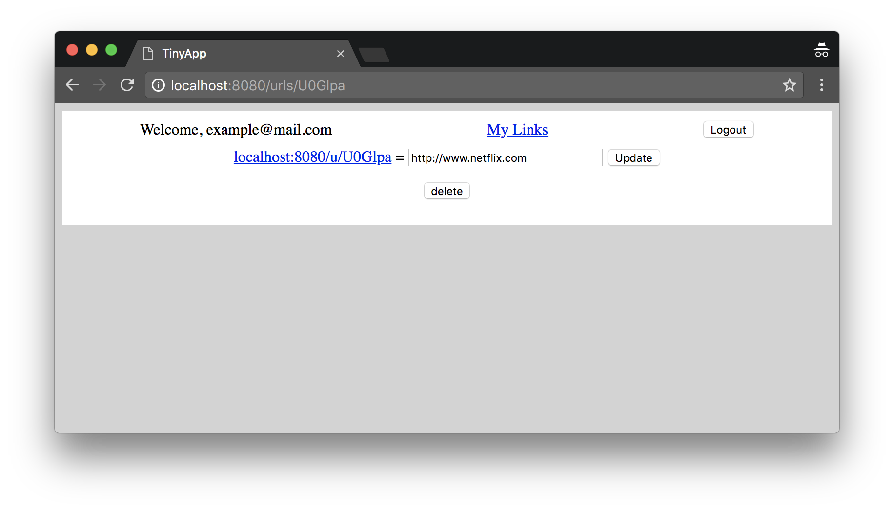

#TinyApp

TinyApp is a web application built in Node.js and Express.js that allows users to create shortened version of URLS.

##Preview

##dependencies

• Node.js
• Express.js
• EJS
• bcrypt
• body-parser
• cookie-parser